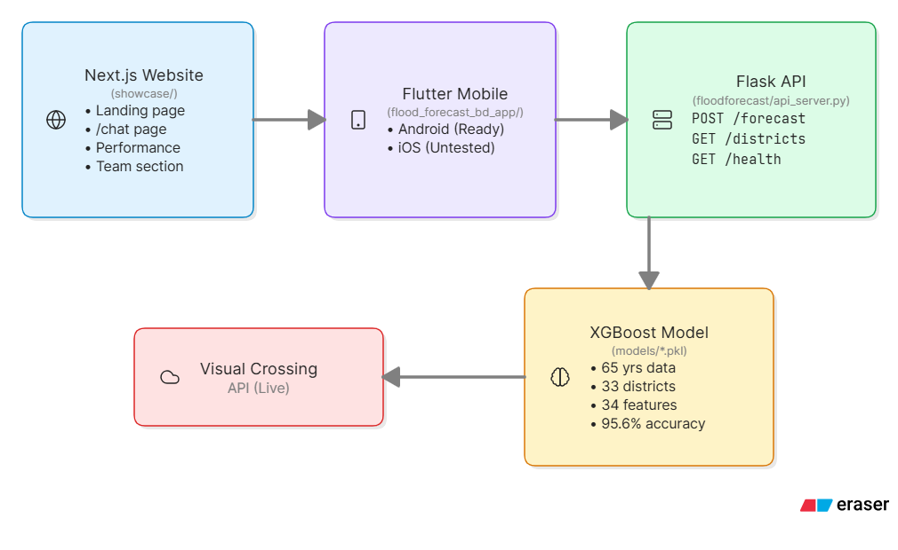
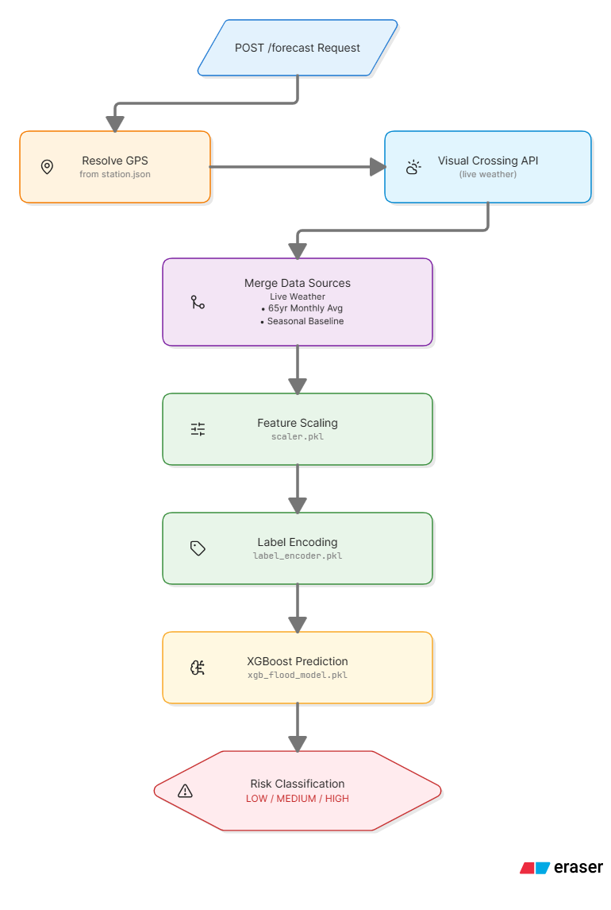

<div align="center">

# 🌊 Flood Forecast BD
### *Real-Time Flood Intelligence System*

🛡️ **CSE445 Machine Learning Project**

---

[](https://www.python.org/)
[](https://nextjs.org/)
[](https://flutter.dev/)
[](https://xgboost.readthedocs.io/)
[](#-machine-learning-engine--validation)

An AI-driven hydrology prediction ecosystem engineered to deliver localized flash flood predictions for **33 distinct geographic stations** across Bangladesh with a **95.6% classification accuracy**. The system couples an advanced **XGBoost machine learning predictive pipeline** built over 65 years of climate records with real-time weather telemetry streams, providing cross-platform foresight via a Next.js 15 analytics portal and a companion Flutter mobile client.

---

### 🗺️ [🚀 Quick Start](#1-configure-visual-crossing-api-key) &nbsp;•&nbsp; 📡 [🔌 API Docs](#-live-production-api-endpoints) &nbsp;•&nbsp; 📊 [📈 Model Metrics](#-machine-learning-engine--validation) &nbsp;•&nbsp; 📦 [📲 Download APK](#4-compiling-and-distributing-the-flutter-client-apk) &nbsp;•&nbsp; 🚀 [🌐 Deploy](#-cloud-production-deployment-guidelines)

</div>

---

## 🏗️ System Architecture & Cross-Component Flow

Our ecosystem consists of three main decoupled components that interact seamlessly over a centralized API layer:

<div align="center">



</div>

### Component Breakdown

1. **Prediction Server (`/floodforecast`):** A lightweight production-ready Python Flask backend that encapsulates our optimized model weights, exposes operational endpoints, fetches live meteorology conditions, and generates dynamic inference arrays.

2. **Web Showcase Portal (`/showcase`):** An immersive analytics dashboard designed with Next.js 15 (App Router), Tailwind CSS, and Framer Motion. Features a dedicated `/chat` standalone conversational workspace communicating directly with the backend pipeline.

3. **Mobile App (`/flood_forecast_bd_app`):** A cross-platform mobile client engineered with Flutter featuring animated probability gauges, interactive station mapping, and offline-resilient local fallback cards.
   * **Android Client:** Fully built, tested, optimized, and ready for deployment.
   * **iOS Client:** Structural application files, routing architecture, and native multi-platform configurations are completely implemented. However, the iOS app build remains **untested** due to current ecosystem environment limitations.

---

## 📊 Dataset & Advanced Feature Engineering

* **Core Source:** Model pipelines are trained using the official Kaggle [Flood Prediction Dataset (n-gauhar/Flood-prediction)](https://www.kaggle.com/datasets/n-gauhar/flood-prediction), tracking **35,000+ matrix rows** spanning **1949 to 2013** across **33 primary weather stations** in Bangladesh.
* **Base Parameters:** Station Name, Year, Month, Max Temperature, Min Temperature, Rainfall, Humidity, Wind Speed, Cloud Cover, Sunshine, GPS Coordinates, and Binary Flood Label.
* **Engineered Lag & Interaction Matrix (34 Features Total):**
  * **Precipitation Lags:** Rainfall lag offsets across 1, 2, and 3-month thresholds to model soil saturation indices.
  * **Thermal & Climate Lags:** Temperature and humidity temporal adjustments backlogged across 3 tracking cycles.
  * **Interaction Metrics:** Thermal Multiplier Spread ($Max\ Temp - Min\ Temp$) and Precipitation $\times$ Humidity compounding intensity weights.
  * **Monsoon Weights:** A seasonal classification matrix locking high priority values ($1.0$) exclusively within the active June-September window.
  * **Rolling Baselines:** 3-month statistical rolling averages to flatten seasonal spikes.

### Feature Engineering Pipeline

```
FEATURE ENGINEERING PIPELINE (20 FEATURES)
═══════════════════════════════════════════════════════════════════

  Base Features (6)
  ├── Station_Encoded    →  LabelEncoder integer mapping
  ├── Month              →  Cyclical month value
  ├── Max_Temp           →  Maximum temperature (°C)
  ├── Min_Temp           →  Minimum temperature (°C)
  ├── Rainfall           →  Precipitation amount (mm)
  └── Relative_Humidity  →  Humidity percentage (%)

  Derived Features (5)
  ├── Wind_Speed         →  Wind velocity (km/h)
  ├── Cloud_Coverage     →  Cloud cover percentage
  ├── Bright_Sunshine    →  Sunshine hours
  ├── Temp_Range         →  Max_Temp - Min_Temp (diurnal range)
  └── Rainfall_Humidity  →  Rainfall × Humidity (compound intensity)

  Monsoon Features (2)
  ├── Monsoon_Intensity  →  1.0 if month ∈ {6,7,8,9}, else 0.2
  └── Rainfall_Monsoon   →  Rainfall × Monsoon_Intensity

  Rolling Baseline (1)
  └── Rainfall Rolling Mean 3  →  3-month rolling average

  Lag Features (6)
  ├── Rainfall_lag_1          →  1-month precipitation offset
  ├── Rainfall_lag_2          →  2-month precipitation offset
  ├── Rainfall_lag_3          →  3-month precipitation offset
  ├── Max_Temp_lag_1          →  1-month temperature offset
  ├── Min_Temp_lag_1          →  1-month min temperature offset
  └── Relative_Humidity_lag_1 →  1-month humidity offset
```

---

## 🔬 Machine Learning Engine & Validation

The core predictive system was trained using structured temporal constraints to completely prevent data leakage:

* **Validation Split Strategy:** Configured via `TimeSeriesSplit` cross-validation to preserve chronologically dependent trends.
* **Hyperparameter Optimization:** Trained utilizing `GridSearchCV` to optimize estimators, learning rates, tree depth, and column subsampling balances.
* **Classification Cutoff:** Evaluated at a dynamic probability threshold ($P > 0.5 \implies \text{Flood Event}$).

### Training Configuration

```python
# floodforecast/ml_pipeline/train.py — Core Training Setup

import xgboost as xgb
from sklearn.model_selection import TimeSeriesSplit, GridSearchCV
from sklearn.metrics import (
    accuracy_score, roc_auc_score, f1_score,
    precision_score, recall_score, classification_report
)

# Temporal split to prevent data leakage
tscv = TimeSeriesSplit(n_splits=5)

# Hyperparameter grid for GridSearchCV
param_grid = {
    "n_estimators":     [100, 200, 300],
    "max_depth":        [4, 6, 8],
    "learning_rate":    [0.01, 0.05, 0.1],
    "subsample":        [0.8, 0.9],
    "colsample_bytree": [0.8, 0.9],
    "scale_pos_weight": [1, 2],        # Handle class imbalance
}

grid_search = GridSearchCV(
    estimator=xgb.XGBClassifier(
        objective="binary:logistic",
        eval_metric="auc",
        use_label_encoder=False,
        random_state=42
    ),
    param_grid=param_grid,
    cv=tscv,
    scoring="roc_auc",
    n_jobs=-1,
    verbose=1
)

grid_search.fit(X_train, y_train)

# Dynamic threshold tuning
y_proba = grid_search.predict_proba(X_valid)[:, 1]
threshold = find_optimal_threshold(y_valid, y_proba)  # ~0.52
y_pred = (y_proba > threshold).astype(int)
```

### Classification Decision Boundary

```
              FLOOD RISK CLASSIFICATION LOGIC
    ═══════════════════════════════════════════════

    Predicted Probability (P)     Risk Category
    ─────────────────────────     ─────────────
    P > 0.66                      HIGH   🔴
    0.33 < P ≤ 0.66               MEDIUM 🟡
    P ≤ 0.33                      LOW    🟢

    Model: XGBoost Binary Classifier
    Thresholds: Dynamically tuned during validation
```

### Operational Performance Metrics

| Performance Metric | Evaluation Value |
| :--- | :--- |
| **Model Classification Accuracy** | 95.6% |
| **Area Under Curve (ROC-AUC)** | 98.7% |
| **F1-Score Profile** | 89.2% |
| **Precision** | 88.3% |
| **Recall** | 90.0% |

> 🔗 **Foundational Repository & Model Architecture:** For deep-dive architectural insights, alternative foundational training scripts, and underlying chat records utilized during early research cycles, see our parallel repository: [tousifmuhimine/Flood-Forecasting-BD](https://github.com/tousifmuhimine/Flood-Forecasting-BD). (Visual code baselines and asset alignments can be verified directly via project reference images `screencapture-github-tousifmuhimine-Flood-Forecasting-BD-2026-07-15-01_41_52.jpg` and `image_b608a1.png`).

---

## 📡 Live Production API Endpoints

The Flask predictive microservice exposes the following operational JSON endpoints:

* `GET /health` — Diagnostics verification checking ML pipeline readiness and file safety handles.
* `GET /districts` — Extracts all 33 valid weather stations paired alongside mapped precise latitude/longitude coordinate bounds.
* `GET /model/info` — Emits current system validation parameters, accuracy rates, and trained weight configurations.
* `POST /forecast` — Accepts a payload identifying an evaluation district target (e.g., `{"district": "Sunamganj"}`). Operates as follows:
  1. Resolves coordinates via `station.json`.
  2. Queries the **Visual Crossing API** for real-time live regional meteorology.
  3. Merges live variables alongside the 65-year seasonal monthly climate baseline matrix.
  4. Formulates feature scaling vectors via our exported `scaler.pkl` and encodes parameters through `label_encoder.pkl`.
  5. Evaluates live weights using `xgb_flood_model.pkl` and yields localized predictive risk categories (`LOW`, `MEDIUM`, `HIGH`) and raw scalar confidence values.

### `GET /health`

```bash
curl http://localhost:5000/health
```

```json
{
  "status": "healthy",
  "model_loaded": true,
  "scaler_loaded": true,
  "encoder_loaded": true,
  "models": {
    "xgb_flood_model.pkl": true,
    "scaler.pkl": true,
    "label_encoder.pkl": true
  },
  "uptime_seconds": 3847.21
}
```

### `GET /districts`

```bash
curl http://localhost:5000/districts
```

```json
{
  "count": 33,
  "districts": [
    { "name": "Dhaka",         "latitude": 23.8103, "longitude": 90.4125 },
    { "name": "Chittagong",    "latitude": 22.3569, "longitude": 91.7832 },
    { "name": "Sunamganj",     "latitude": 25.0667, "longitude": 90.8333 },
    { "name": "Sylhet",        "latitude": 24.8949, "longitude": 91.8687 },
    { "name": "Rajshahi",      "latitude": 24.3636, "longitude": 88.6241 },
    { "...": "..." }
  ]
}
```

### `GET /model/info`

```bash
curl http://localhost:5000/model/info
```

```json
{
  "model": "XGBoost Binary Classifier",
  "accuracy": 0.956,
  "auc_roc": 0.987,
  "f1_score": 0.892,
  "features": 34,
  "training_samples": 28000,
  "validation_samples": 7000,
  "temporal_range": "1949-2013"
}
```

### `POST /forecast`

```bash
curl -X POST http://localhost:5000/forecast \
  -H "Content-Type: application/json" \
  -d '{"district": "Sunamganj"}'
```

```json
{
  "district": "Sunamganj",
  "coordinates": { "latitude": 25.0667, "longitude": 90.8333 },
  "prediction": {
    "risk_level": "HIGH",
    "probability": 0.87,
    "confidence": 0.93
  },
  "weather": {
    "temperature": 32.4,
    "humidity": 89,
    "rainfall": 42.5,
    "wind_speed": 18.2
  },
  "seasonal_baseline": {
    "avg_rainfall_month": 350.2,
    "monsoon_active": true
  },
  "timestamp": "2026-07-15T10:30:00Z"
}
```

### Inference Pipeline Flow

<div align="center">



</div>

---

## 🎨 Showcase Website — Next.js 15

### Tech Stack

| Layer | Technology | Purpose |
|:------|:-----------|:--------|
| Framework | Next.js 15 (App Router) | SSR/SSG rendering, file-based routing |
| Styling | Tailwind CSS | Utility-first design, CSS variable theming |
| Animation | Framer Motion | Scroll-triggered reveals, page transitions |
| Charts | Recharts | Bar charts for feature importance, model metrics |
| Theming | Custom `ThemeProvider` | Dark/Light mode with `localStorage` persistence |
| Typography | Inter + JetBrains Mono | Display headings + monospace metrics |
| Icons | Lucide React | Consistent icon system |

### Design System — Deep Sonar

```
  COLOR PALETTE
  ═══════════════════════════════════════════════════

  Dark Mode (Default)
  ├── Background:    #030712  (near-black)
  ├── Surface:       #111827  (dark slate)
  ├── Card:          #1f2937  (card surface)
  ├── Border:        #374151  (subtle border)
  ├── Text Primary:  #f9fafb  (near-white)
  └── Text Muted:    #9ca3af  (gray)

  Light Mode
  ├── Background:    #f8fafc  (soft white)
  ├── Surface:       #ffffff  (pure white)
  ├── Card:          #f1f5f9  (off-white)
  ├── Border:        #e2e8f0  (light border)
  ├── Text Primary:  #0f172a  (slate-900)
  └── Text Muted:    #64748b  (slate-500)

  Accent Colors (Shared)
  ├── High Risk:     #f43f5e  (rose-500)
  ├── Medium Risk:   #f59e0b  (amber-500)
  ├── Low Risk:      #10b981  (emerald-500)
  ├── Accent Blue:   #0ea5e9  (sky-500)
  └── Glow:          #0ea5e933 (accent with alpha)
```

### Key Pages

| Route | Component | Description |
|:------|:----------|:------------|
| `/` | `page.tsx` | Landing page: Hero → NewsHub → MLEngine → Literature → Architecture → Performance → TeamSection |
| `/chat` | `chat/page.tsx` | Standalone interactive chat interface with Flask backend |

---

## 📱 Flutter Mobile Application

### Feature Matrix

| Screen | Features |
|:-------|:---------|
| **Home Dashboard** | Animated risk cards, current month forecast, district selector, dark/light toggle |
| **Forecast Screen** | Animated circular probability gauge, 34-feature prediction breakdown, station metadata |
| **Map Screen** | Interactive `flutter_map` with OpenStreetMap tiles, station markers, risk-colored popups |
| **Chat Screen** | AI assistant via Groq API, message bubbles, typing indicators, theme-aware |

### Theming — Dark/Light Toggle

```dart
// lib/theme/app_theme.dart
class AppTheme {
  static Color background(BuildContext context) =>
      Theme.of(context).brightness == Brightness.dark
          ? const Color(0xFF030712)
          : const Color(0xFFF8FAFSC);

  static Color card(BuildContext context) =>
      Theme.of(context).brightness == Brightness.dark
          ? const Color(0xFF1F2937)
          : Colors.white;
}

// lib/theme/theme_provider.dart
class ThemeNotifier extends ChangeNotifier {
  ThemeMode _themeMode = ThemeMode.dark;

  ThemeMode get themeMode => _themeMode;

  void toggleTheme() {
    _themeMode = _themeMode == ThemeMode.dark
        ? ThemeMode.light
        : ThemeMode.dark;
    SharedPreferences.getInstance().then((prefs) {
      prefs.setString('theme_mode', _themeMode.name);
    });
    notifyListeners();
  }
}
```

---

## 🛠️ Local Bootstrapping & Production Build Pipelines

### 1. Configure API Keys

The backend requires two API keys:

1. **Visual Crossing** — live weather data ([sign up free](https://www.visualcrossing.com/))
2. **Groq** — LLM chat completions ([sign up free](https://console.groq.com/))

Create `floodforecast/.env` with both keys:

```bash
cat > floodforecast/.env << EOF
VC_API_KEY=YOUR_VISUAL_CROSSING_KEY
GROQ_API_KEY=YOUR_GROQ_KEY
EOF
```

> The `.env` file is gitignored. Never commit API keys to version control.

### 2. Booting the Predictive Flask Server

```bash
pip install -r requirements.txt

# Run feature engineering, lag generations, and train the model binary
cd floodforecast
python ml_pipeline/train.py

# Launch the prediction engine locally (binds onto localhost:5000)
python api_server.py
```

### 3. Spinning Up the Next.js Analytics Web Portal

```bash
cd showcase
npm install
npm run dev
```

### 4. Compiling and Distributing the Flutter Client (APK)

To package the cross-platform application for deployment and compile a high-performance production build, execute the following pipelines:

```bash
cd flood_forecast_bd_app
flutter pub get

# Compile a minified production release APK optimized for Android devices
flutter build apk --release
# Output: build/app/outputs/flutter-apk/app-release.apk
```

### 📦 Setting Up Free GitHub Release Asset Hosting

1. Locate the compiled production binary asset on your local system path: `build/app/outputs/flutter-apk/app-release.apk`.
2. Navigate to your project repository on GitHub web.
3. On the right-hand sidebar navigation panels, click on **Releases** ➔ Select **Draft a new release**.
4. Specify your production release version tag (e.g., `v1.0.0`) and enter a release title.
5. Drag and drop the `app-release.apk` file directly into the **Attach binaries by dropping them here** deployment field.
6. Click **Publish release**. Copy the absolute asset link of your uploaded `.apk` file and attach it directly to the download call-to-actions on your live Vercel web application dashboard.

---

## 🌐 Cloud Production Deployment Guidelines

### 🌐 Next.js Showcase Layout ➔ Vercel

1. Point your Vercel workspace directly to the code repository.
2. Ensure the build directory explicitly references or overrides into the `/showcase` nested directory level.
3. Configure your global Environment Variables to link your live production endpoint: `NEXT_PUBLIC_API_URL=https://your-huggingface-space-name.hf.space`.

### ⚡ Predictive Server Layer ➔ Hugging Face Spaces

1. Spin up a brand new Hugging Face Space utilizing a standard **Blank Python Space** or **Docker** configuration layer.
2. Push the isolated standalone contents of your `/floodforecast` subdirectory straight into the master root level of your Hugging Face Space repository.
3. Ensure your production configuration scripts utilize active `flask_cors` setup rules to allow browser cross-origin calls traveling into your Space from your live Vercel web domain.

---

## 📁 Project Structure

```
cse445_flood_forecast_bd/
├── README.md                          ← You are here
├── vercel.json                        ← Vercel deployment config
├── requirements.txt                   ← Python dependencies (backend)
├── releases/
│   └── flood_forecast_bd.apk          ← Pre-built Android release APK
│
├── showcase/                          ← Next.js 15 Analytics Website
│   ├── package.json
│   ├── next.config.ts
│   ├── tailwind.config.ts
│   ├── tsconfig.json
│   ├── postcss.config.mjs
│   ├── app/
│   │   ├── layout.tsx                 ← Root layout (fonts, ThemeProvider)
│   │   ├── globals.css                ← CSS variables (dark/light)
│   │   ├── page.tsx                   ← Landing page composition
│   │   └── chat/
│   │       └── page.tsx               ← Standalone chat route
│   ├── components/
│   │   ├── ThemeProvider.tsx           ← Dark/Light context + localStorage
│   │   ├── Navbar.tsx                 ← Sticky glass nav + theme toggle
│   │   ├── Hero.tsx                   ← FluidWave + MetricCards
│   │   ├── NewsHub.tsx                ← Live RSS feed (allorigins.win)
│   │   ├── MLEngine.tsx               ← Pipeline visualization
│   │   ├── Literature.tsx             ← Paper cards + novelty
│   │   ├── Architecture.tsx           ← 3-component architecture blocks
│   │   ├── Performance.tsx            ← Confusion matrix + metrics
│   │   ├── TeamSection.tsx            ← Team cards with GitHub API
│   │   ├── TeamCards.tsx              ← GitHub stats cards (Footer)
│   │   ├── ChatSimulation.tsx         ← Interactive chat component
│   │   ├── Footer.tsx                 ← Brand + links
│   │   └── ui/
│   │       ├── FluidWave.tsx          ← SVG wave (theme-aware)
│   │       ├── MetricCard.tsx
│   │       ├── FeatureBar.tsx
│   │       ├── GlassCard.tsx
│   │       └── RadarPulse.tsx
│   └── lib/
│       └── data.ts                    ← All constants (metrics, team, papers)
│
├── floodforecast/                     ← Flask ML Backend
│   ├── api_server.py                  ← REST API (Flask)
│   ├── ml_pipeline/
│   │   └── train.py                   ← XGBoost training pipeline
│   ├── models/
│   │   ├── xgb_flood_model.pkl
│   │   ├── scaler.pkl
│   │   └── label_encoder.pkl
│   ├── data/
│   │   ├── dataset.csv
│   │   └── station.json               ← 33 station coordinates
│   ├── utils/
│   │   └── config.py
│   └── tests/
│       ├── test_api.py
│       └── test_pipeline.py
│
└── flood_foreast_bd_app/              ← Flutter Mobile Client
    ├── pubspec.yaml
    ├── android/
    ├── ios/                           ← iOS files included (untested)
    └── lib/
        ├── main.dart                  ← Provider setup + MaterialApp
        ├── theme/
        │   ├── app_theme.dart         ← Dark + Light theme definitions
        │   └── theme_provider.dart    ← ThemeNotifier + SharedPreferences
        ├── screens/
        │   ├── home_screen.dart       ← Dashboard + forecast cards
        │   ├── forecast_screen.dart   ← Animated probability gauge
        │   ├── map_screen.dart        ← flutter_map + station markers
        │   └── chat_screen.dart       ← Groq-powered AI chat
        ├── widgets/
        │   ├── risk_card.dart         ← Risk level display card
        │   └── weather_card.dart      ← Current weather conditions
        ├── services/
        │   ├── api_service.dart       ← Flask API client
        │   └── chat_service.dart      ← Groq LLM integration
        └── models/
            ├── forecast.dart
            └── district.dart
```

---

## 👥 Engineering Contributors

Show some love to the engineering core behind this system validation framework:

<table align="center">
  <tr>
    <td align="center" width="160px">
      <a href="https://github.com/tousifmuhimine">
        <br />
        <sub><b>Abdullah Al Muhimine</b></sub><br />
        <sub>2131662642</sub>
      </a>
    </td>
    <td align="center" width="160px">
      <a href="https://github.com/mostakim52">
        <br />
        <sub><b>Mostakim Hossain</b></sub><br />
        <sub>2131545042</sub>
      </a>
    </td>
    <td align="center" width="160px">
      <a href="https://github.com/sinhajul">
        <br />
        <sub><b>Sinhadul Islam</b></sub><br />
        <sub>2131211042</sub>
      </a>
    </td>
    <td align="center" width="160px">
      <a href="https://github.com/shafkatsharif">
        <br />
        <sub><b>Shafkat Sharif</b></sub><br />
        <sub>2132314642</sub>
      </a>
    </td>
  </tr>
</table>

---

🔬 Developed as a Project for **CSE 445 Machine Learning** at North South University.
